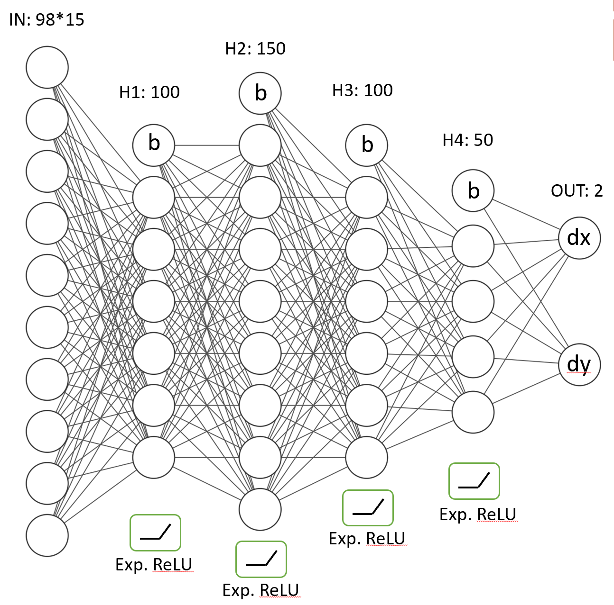
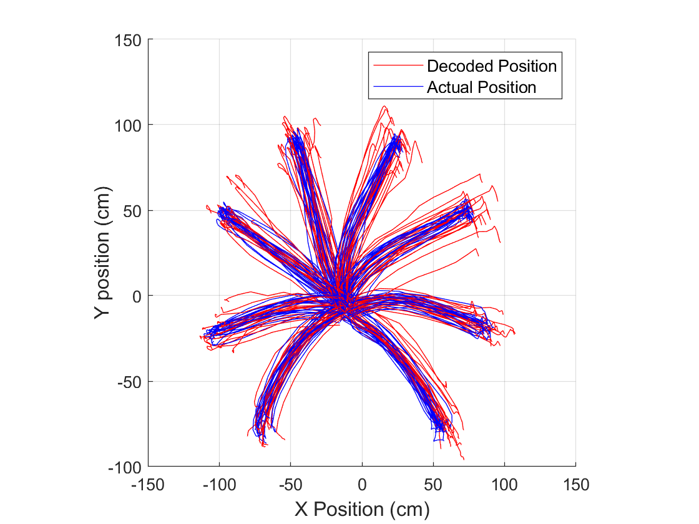

# Neural Decoding Using a Feedforward Neural Network for Predicting Motion

This project includes a neural networks regression model that predicts the position of the hand of a monkey using the brain signals that was extracted from the monkey during previous movement experiments. It was submitted to the Brain-Machine Interfaces course competition and and had the 2nd place among 30 participating groups. The details of the competition are given in [CompRules.pdf](CompRules.pdf).

## Description

The brain signals that was used in this model was given in the [monkeydata_training.mat](monkeydata_training.mat) file, which is explained in detail in the [DescriptionOfData.pdf](DescriptionOfData.pdf) document. In the model, the data was preprocessed and used in the neural network training. The neural network architecture after parameter optimization was given on the figure below:

## Results 

The proposed model achieved 11.16 cm RMSE error on unseen testing data. The resulting tracking trajectories are shown here:

The details of the project and the results can be found in [BMI_Report.pdf](BMI_Report.pdf).

## Dependedcies

- Matlab

This project doesnt require any external software or libraries.

## Quick Guide

Runnig the [MasterCode.m](MasterCode.m) script on Matlab will train the network and then evaluate it on the validation data.
